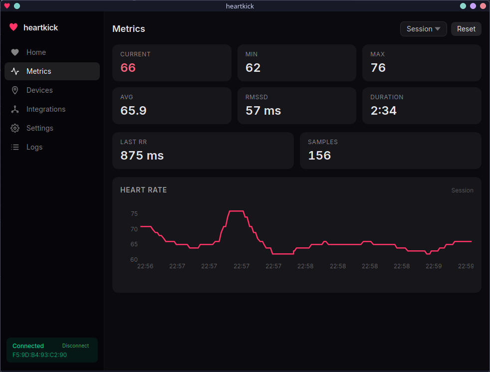
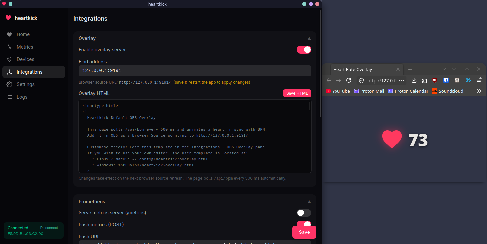

<p align="center">
  
</p>

<h1 align="center">heartkick</h1>

<p align="center">
  <a href="https://github.com/dhopcs/heartkick/actions/workflows/ci.yml"></a>
  <a href="https://github.com/dhopcs/heartkick/actions/workflows/build.yml"></a>
  
  
  
  <a href="https://github.com/dhopcs/heartkick/blob/main/LICENSE"></a>
</p>

Heart rate monitor app for desktop and Android. Connects to Bluetooth HR sensors and shows live BPM, HRV, and session stats. Pushes data out to OBS, OSC, webhooks, and Prometheus if you want it to. Built with Rust, Tauri, Preact, Tailwind and Ratatui.

---

## Screenshots

<p align="center">
  
  
</p>

---

## Features

- Tauri desktop app + Android app (API 26+)
- TUI mode for terminal enjoyers and low-resource environments
- Daemon mode with no UI for integrated use
- Live BPM gauge with HRV (RMSSD) and session stats (min/max/avg, elapsed)
- Bluetooth LE - connects to any standard HR monitor; auto-reconnect on drop
- Session history stored in SQLite
- HTTP API on `127.0.0.1:7878` (optional Bearer token auth)
- Unix socket API
- OBS browser-source overlay (customisable HTML)
- OSC output for VR / VTubing rigs etc.
- Webhooks with `{bpm}` / `{rr}` / `{timestamp}` substitutions
- Prometheus metrics (pull endpoint + optional remote-write push)
- Desktop (Linux, macOS, Windows) and Android (API 26+)
- Configurable via `~/.config/heartkick/config.toml` (or OS equivalent)

## Install

Go to the [releases page](https://github.com/dhopcs/heartkick/releases) and grab the relevant installer for your platform. Install and run it, and you should be good to go.

For Arch Linux users, `heartkick` `heartkick-git` and `heartkick-bin` are available on AUR.

**Dependencies:** Rust (stable), Node.js, pnpm

```bash
git clone https://github.com/dhopcs/heartkick
cd heartkick
pnpm install
pnpm tauri build
```

The installer ends up in `src-tauri/target/release/bundle/` - `.deb` and `.AppImage` on Linux, `.dmg` on macOS, `.msi` on Windows. For Android, follow the instructions in the Setup section below. (TODO: F-droid release)

## Setup

**Dependencies**

```
rust
pnpm
```

Android builds additionally need the Android SDK (API 36), NDK 29, and a JDK. Set:

```bash
export ANDROID_HOME=$HOME/Android/Sdk
export NDK_HOME=$ANDROID_HOME/ndk/29.0.13846066
```


**Build for Android**

```bash
just make-keystore    # generate keystore for signing APK

# Option 1: build + sign, output at `src-tauri/gen/android/app/build/outputs/apk/universal/release/heartkick-signed.apk`
just build-android    # build APK (unsigned)
just sign-apk         # sign APK and install on connected device

# Option 2: build, sign, and install in one step (requires android device connected with USB debugging enabled)
just local-install    # build, sign, and install APK on connected device
```

## Config

Config lives at the OS standard location (`~/.config/heartkick/config.toml` on Linux). It's created with defaults on first run. Integrations are all opt-in.

```toml
[bluetooth]
device_address = "AA:BB:CC:DD:EE:FF"
auto_reconnect = true

[api]
http_enabled = true
http_bind = "127.0.0.1:7878"

[integrations.osc]
enabled = true
target = "127.0.0.1:9000"
address = "/avatar/parameters/HR"

[[integrations.webhooks]]
name = "my-webhook"
enabled = true
method = "POST"
url = "https://example.com/hr"
body = '{"bpm":{bpm}}'

[integrations.prometheus]
enabled = true
bind = "127.0.0.1:9091"
```

## License

MIT
